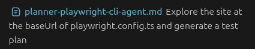
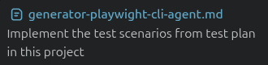
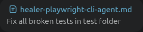

<div align="center">

# 🤖 Playwright CLI Testing Agents

Specialized AI agents for Playwright test planning, generation, and healing using Playwright CLI (as opposed to Playwright MCP)

English | [🇪🇸 Español](README.es.md)


</div>

---

## Playwright CLI vs Playwright MCP

The original Playwright Test Agents are MCP-based and rely on the Model Context Protocol (MCP) tools. 

When agents work with Playwright MCP 
they are constantly consuming  full accessibility/DOM tree snapshots inside the model context.  

With Playwright CLI, agents work with so-called semantic or ref-based snapshots, which are more compact structures. 

**In early 2026, Playwright introduced [Playwright-CLI](https://playwright.dev/agent-cli/introduction?utm_source=chatgpt.com), "a  command-line interface for browser automation designed for coding agents".**

Playwright officially recommends its CLI for coding-agent workflows due to significantly lower token consumption, improved session scalability.


Note: There are use cases where MCP-based agents would still be arguably prefered over CLI (e.g. rich exploratory testing sessions,  debugging complex UI bugs). 

--- 

## Overview

This repository provides Playwright-CLI agent definitions (markdown files) that can be used to execute these workflows:

- Explore and browse a site and create a test plan of the explored test scenarios 
- Generate playwright tests (spec.ts files) for each scenario in the plan
- Run the tests to verify all tests passed. If there are failing tests it debugs the root cause, repairs the failing tets or -if the fail is an actual fail,  marks the test  with the `fix.me fixture`

PONER UN TITULO DESCRIPTIVO AQUI

Each of these workflows can be run is any AI-assisted development environments such as Codex, Claude Code or Cursor.

The full workflow (planning, code generation and debugging/fixing tests) is, by its own nature, sequential (as opposed to parallel).

All the agents rely on `Playwright CLI` to do their job and do not use Playwright MCP tools nor any other MCP. 

All agents are fully autonomous and will execute their task in one go. However, they may ocassionally ask the user for guidance if they encounter a decision for which they require permissions they don't have under their current settings (e.g. network requests outside their workspace) 


This means they do not use any Playwright MCP tools, nor any other MCP. 
---
This means they do not use any Playwright MCP tools, nor any other MCP. 
## Use cases

You can use just one of the agents, a combination of them, or all of them depending on your workflow.

### Planner agent workflow

- Planner will thoroughly explore the site (or a feature/user story you decide) and create a test plan in a markdown file. 
- It will only use Playwright CLI
- You can prompt it to plan test scenarios for a specific page/feature or for the entire site (however, for better quality of output we recommend to plan one page/feature at a time)

 This plan can serve different purposes, depending on the user:

 **Manual testers**:

- It is a detailed test suite where each test scenario has detailed steps, preconditions and expected results. 
- Manual testers can use it as instructions for execution or as a first overview of possible test scenarios.   

**Automation testers**

- It contains playwright locator hints and suggested assertions for each test scenario. 
- This can be useful and a time-saver for automation testers that are implementing playwright tests


### Planner + Generator workflow
- Planner outputs a test plan.
- Generator will read the plan and implement each test scenario as a `spec.ts` file, probably using the suggested locators and assertions.
- It will stop when it finishes implementing the code. 
- Generator will only use Playwright CLI to inspect the site when test plan info is missing, outdated or just not enough.
- **Generator will never run the tests it implements, not will it debug them if they don't pass (that's healer agent's job)**.

### Planner + Generator + Healer workflow
- Planner outputs a test plan.
- Generator outputs `spec.ts` files, one per test scenario defined in the plan.
- Healer runs the tests
    - If all test pass, healer finishes its work.
    - If there are failing tests, healer debug the root cause:
        - If root cause is a bug in the test it fixes it and rerun until the test passes
        - If healer believes (after debugging and retesting) root cause is a bug in the app under test, it marks the test with playwright fixture `test.fixme`
        - When all failed tests were either fixed or marked with `test.fixme` healer stops.

---

## Local setup

You need to have any of these: codex app, codex VSC extension, claude code app, claude code VSC extension, cursor, cline or any other app/extension with agentic capabilities.

You need to use at least Node 20 (*Node 22 is recommended)*  


### Install dependencies:

```sh
npm -D install
```

### Project configuration and test data

- Out of the box the project is configured to test a demo site (`parabank.parasoft.com`) and has a test user credentials in .env file. You should update these settings as follows:

- In `playwright.config.ts` set baseUrl to the that of the target site:

```ts
export default defineConfig({
    ...
use: {
    baseURL: 'https://testundersubject.com',
```
- If the site requires authentication you can provide them in the .env file or in a place of your choice (you should let all the agents know this in the prompt)

- **Important: Even if agents do not need to authenticate delete the original contents of .env file** otherwise the prompt will be noisy, confusing the agent, which may result in low quality output.

### Agent permissions

- Make sure your agent has read/write/run permissions (for example: if you are using Codex, set permissions to `default permissions`)

### Agent context

- Make sure you add the agent definition markdown file in the agent context 

- Before running an agent **always make sure their context is not polluted** with agent-generated output files from previous runs, nor with human generated files (e.g. `test-results` folder) or any reports your manual runs may have created. 

Examples: 

- If you rerun planner agent you should previously delete (or save somewhere else) the test plan it generated in a previous run

- If you run planner/generator agent you should previously delete `spec.ts` files  with implemented tests that may have been generated in the previous run


## Example prompts 

### Planner



### Generator



### Healer



